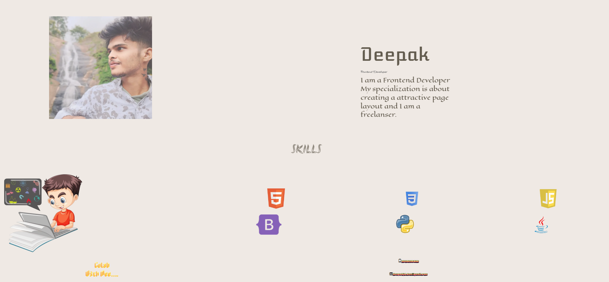

# 💻 Deepak's Portfolio

Welcome to **Deepak's Personal Portfolio**! This project showcases my skills and creativity as a **Frontend Developer**. Whether you're here to view my projects, skills, or get in touch, this portfolio highlights my journey in web development and beyond.

## 🌟 Features

- **Responsive Design**: Ensures compatibility across all devices, from desktops to mobile phones.
- **Skills Showcase**: Highlights my expertise in frontend technologies and programming languages.
- **Smooth Animations**: Engaging transitions and effects for a dynamic user experience.
- **Contact Section**: Easy access to my details for collaborations or inquiries.
- **Tools Section**: Features the software and platforms I use for development.

## 🚀 Technologies Used

- **HTML**: Structuring content and layout.
- **CSS**: Styling and animations for a polished design.
- **JavaScript**: Adding interactivity and functionality.
- **Bootstrap**: For responsive grid-based layouts and components.

## 📚 Getting Started

To view this portfolio locally, follow these steps:

1. **Clone the repository**:
   ```bash
   git clone https://github.com/Deepakjd-dev/portfolio.git
   ```
2. **Navigate to the project directory**:
   ```bash
   cd portfolio
   ```
3. **Open `index.html` in your browser** to explore the portfolio.

## 📸 Screenshots



## 🛠️ Usage

1. Open the portfolio in your browser.
2. Explore the sections:
   - **About Me**: Learn more about my background and expertise.
   - **Skills**: View the technologies I specialize in.
   - **Contact**: Find ways to connect or collaborate with me.
3. Click on any interactive elements to experience the animations and transitions.

## ⚙️ Future Enhancements

- Add a **Projects Section** to showcase completed and ongoing works.
- Integrate a **Blog** for sharing technical insights and tutorials.
- Implement backend features for dynamic content and scalability.

## 🤝 Contributing

Contributions are welcome! If you have ideas or suggestions, feel free to submit a pull request or raise an issue.

## 📄 License

This project is licensed under the MIT License - see the [LICENSE](LICENSE) file for details.
## 📁 File Structure

```plaintext
.
├── assets/
│   ├── css/
│   │   └── style.css        # Styling for the project
│   ├── images/              # Images used across the portfolio
│   └── fonts/               # Custom fonts used in the design
├── index.html               # Main HTML file
└── README.md                # Project documentation
```
## 📞 Contact

Feel free to reach out for collaborations, queries, or just to say hi:

- **Phone**: 6382625086
- **Email**: [deepakjd.dev@gmail.com](mailto:deepakjd.dev@gmail.com)
- **GitHub**: [Deepakjd-dev](https://github.com/Deepakjd-dev)
- **Location**: Coimbatore, India

---

Thank you for visiting my portfolio! ✨
